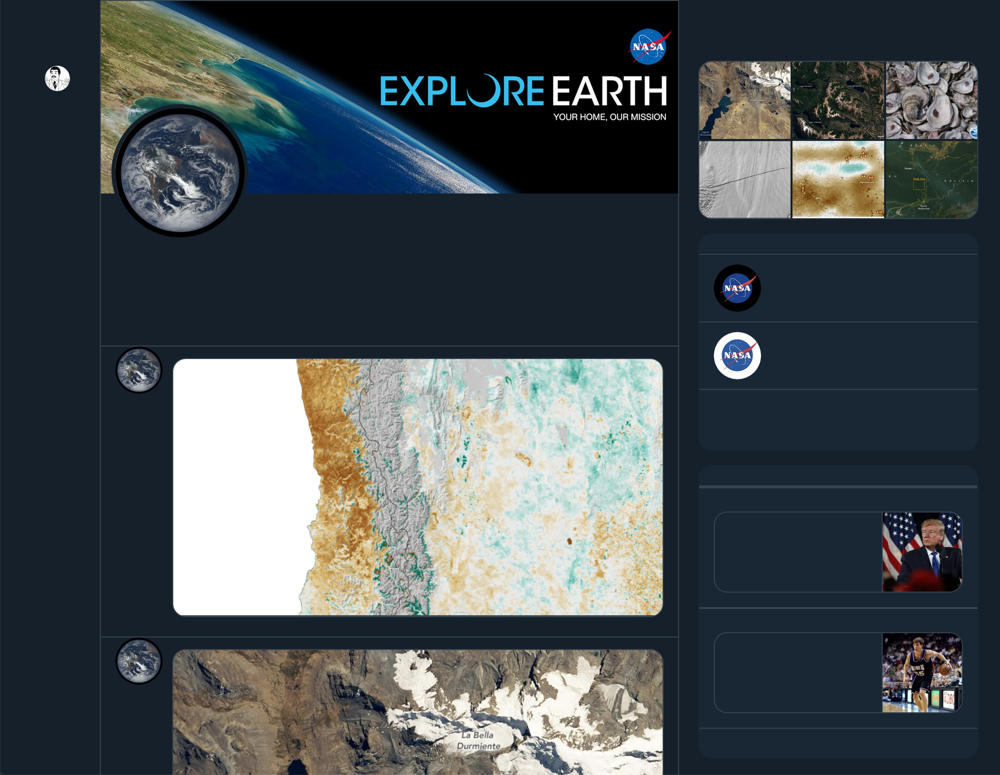

# A Proposal for a Language-Less Network 

## The Present State of Language and The Internet

There's text on every single webpage you visit. 

This is by design. HTML was created specifically for formatting text on a virtual page. ASCII and Unicode were designed for encoding letters, numbers, and other characters for transmission between computers. It makes a lot of sense too; we communicate with language and text is the written manifestation of language. The internet was built for communication, so it was built to move around text. 

For the most part, this has been very beneficial. It has allowed the internet to become perhaps the strongest force in the world, affecting nearly everyone in some way. We all probably have a fairly good sense of the scope of the internet's influence and power in modern life. 

In some ways, however, this dependence on text limits the internet. Having language as a prerequisite means that the internet is in some sense fragmented, as sites must have multiple versions for different languages and some sites are only available in one or two. People that speak English, for example, will have a rather different experience on the internet than people that speak Thai. Some websites are available for only one language; there are likely many more English-only websites than Thai-only. Even though some websites might exist for both, they will most certainly have different content specific to the language. 

While this situation is not bad per se, it is certainly a limitation. While the internet may have been designed to be a universal system, in practice it cannot be due to its dependence on language. There is no universal language, so there is no universal internet. 

## Social Networks and Language 

Built on top of the internet's dependence on language are social networking websites. Let's take Twitter as an example. 

Twitter was designed with language in mind. Removing all of the extraneous baggage, Twitter's function is to allow people to post 240 character messages. It's a network for sharing small snippets of text. Of course there are other types of sharable items on Twitter like links, images, videos, and other Tweets, but at its core Twitter is for text. 

This quality makes Twitter a very loud place. Text is sent back and forth quickly between players, who react and reply as fast as possible. Text is generated extremely quickly, analyzed, then forgotten a few days later. Using text as the medium of communication results in a fast-paced and often troubled network of players. 

It's not just the content that's text, though. Here's a screenshot of a Twitter profile.


Text is used in every part of the profile. The name of the player is visible multiple times, from the very top to each individual post. There's also information about the date they joined, their location, how many followers they have, how many others they're following, a description, and lots more. There's also the panel on the right, which contains information about trends and other players to follow. Text covers this page, not even including the content of the posts. 

Is all of this text necessary? What would removing elements such as the follower count do? What about removing the description? The player's name? What if all the text was gone? 



Without text, Twitter becomes a very quiet place. 

You can try removing all the text on a page by pasting and running this piece of code in your web browser's console. 

```js
window.setInterval(() => {
    document
        .querySelectorAll("a, p, h1, h2, h3, h4, h5, h6, span, div, strong")
        .forEach(node => {
            if (node.tagName === "P" || !node.innerHTML.includes("<img")) {
                node.innerText = "";
            }
        });
}, 1000);

```

There's something very essential about the removing all the text from a Twitter page. All that remains is the most basic form of a profile represented only by a picture. It's clear what a post is from the small profile picture and larger picture content. We've become so accustomed to the prototype of a social media page that even without text it is just as recognizable. 

The quiet and minimal aspect of the pared-down Twitter profile suggests that the design of social networks is far from finished. Using text as the primary mode of communication is just one way of potentially many. Perhaps we can design a more subtle version of a social network that prioritizes different aspects of the experience of being a part of a network.

## A Blueprint For a Language-Less Network 

I propose a network to facilitate the sharing of solely images. It works like this:

- Individuals have a profile that contains their profile image
- Individuals can post images to their profile 
- Individuals can follow other individuals and see a feed of their images
- Individuals can respond other others' posts with images of their own

Perhaps the most important missing piece here is that _there's no text anywhere_ on the network. It's also worth highlighting that individuals _do not have a name_. The only way to differentiate between individuals on this network is from the profile image. 

There is one rule about images:

- The image cannot include overlaid text

Right off the bat, it may appear as if this network is a bit boring. There are plenty of existing photo-sharing services out there. However, the point of this network is not to share photos, but rather to communicate with images. This means the potential for keeping many of the communication features of social networks. For example, you might have the option of replying to someone else's post with an image of your own, or contributing to a string of posts and replies over time. There are a plethora of image-specific features that have never been implemented in social networks before because of social networks' infatuation with text. We can rethink and redesign social networking to use other mediums besides text to produce an equally rich communication experience. 

There are several benefits to this network that might attract some interest.

- No advertisers. The present state of Twitter is that of a perpetual meme war between corporations using interns to wage their battles. Though this network would not explicitly prohibit advertisement, advertisers would have a page like everyone else and have to post images without text. Does this make advertisement ineffective? No, but it makes it much less intrusive and easier to filter out. 
- No trolls. Whoever you might consider to be a troll, they would not have the same means to wreak havoc on your thoughtfully considered post on a nuanced political matter. This is partially because you don't have the opportunity to post an opinion on a political matter, but also because they can't respond to such a post with anything except an image. If you're both posting images, it's hard for things to get too heated (see the section on moderation below for more on this.)
- Creative license. How do you communicate without language? That's up for you to figure out. It seems likely that the community would find ways to share information and experience without explicitly saying anything to each other. There's lots more ways to tell a story than typing it out, and everyone would have the freedom to come up with their own way. 
- Global communication. Without a language barrier, this network can be global. Human understanding of images and the stories they convey is much more universal than a specific cultural context. While culture still plays a role in interpretation, there are certain general heuristics that can be applied universally. There's a reason we can still understand the stories in cave paintings that were created long before the advent of written languages. 

Who would use such a network? I would argue that there's a good enough reason for anyone. Perhaps you want to post pictures of your cat. No problem. Want to find a way to keep in touch with your high school friends that keeps just the right amount of distance? This is for you. Want to create a portfolio of work that your colleagues can see? You can. 

While the proposal that's been outlined here presents a view of what a language-less network might look like, it is by no means exhaustive. I have selected images as the primary medium of communication because of the way that the internet is constructed and because people have easy access to image-making tools. However, there are plenty of other language-less possibilities out there that might also present interesting alternatives to text. As the internet changes and new technologies develop, these other possibilities might be integrated into this network. All options, including images, require a redesign of how a social network works as each implementation is contingent on the particular medium being used. Even a product like Instagram is a poor representation of how this language-less network would work because of all the additional text-based features that are a part of it. Comments and likes, for example, define much of the experience of using Instagram. Removing these and instituting some a few key restrictions on the content would vastly alter the way that it's used and by whom. 

## Considerations 

There are several important considerations to how this network would be designed that would have a significant impact on the experience of using it. Here are a few of them. 

### Global vs Local Scale

The scale of a social network is one key aspect of both who uses it and how it's used. I previously mentioned that this network could be global in scale due to is language-less nature. However, smaller groups online are a important part of fostering a sense of community between individuals who don't know each other. While I offer no solutions to this problem here, there's a key part of this network that I think would help in developing this important property. 

This network is fairly unique in that it is semi-anonymous. There's no way to know who someone is behind their profile (as there might be on Facebook) but there's also a profile picture that makes the poster distinguishable over time (unlike anonymous systems like 4chan.) When communicating with a semi-anonymous person online, there's a certain level of guesswork that goes on and you begin to develop a sense of who they are from what they post, what they say, and the communication you have with them. This process is unique to the internet and one of the more positive aspects of semi-anonymous communication. It also helps prevent the kinds targeted harassment that happens on networks where the true identity of a player is known. 

### Moderation

In a system that uses images as the primary medium, moderating the content of these images is bound to become an issue. I think here Reddit is a particularly good model. With some exceptions, a wide range of content is allowed on Reddit. Each Subreddit has its own rules that define the acceptable content posted to each. All are required to moderate for some kinds of content as required by regional laws and Reddit's own policies. Beyond that, moderators specific to each Subreddit make the final call.

A similar system might be developed for this network, where instead of moderators determining what kinds of content is acceptable, each individual does. Certain types of content would be restricted on the network level to ensure regional laws are followed, but otherwise it is up to the individuals. This could be as simple as flipping a switch; you might not want to see pornographic imagery so all images flagged as pornography by the system aren't shown. 

Of course, this moderation system is just one possibility. It's one that I would argue offers both the most protection and freedom at the same time, as each person has the ability to choose what's acceptable for them. This is an area where everyone has their own opinion on how to place the line between liberty and protection online, and this would be my solution. It's not perfect, but I think it offers a way to make everyone happy. The point remains, though, that thoughtful moderation would be a crucial part of this network. 

### Network Architecture

So far, I've described this system in the conventional style of a digital service on the internet. An individual makes an account and their information is saved on a server that is owned by the service. Any posts the individual makes are saved to the service's servers. While this is one possible way to build this network, it doesn't have to be the only one. There are other decentralized models that might be better from a privacy and individual autonomy standpoint. This is another area that has great potential to change as the conventions around the internet change. If the web becomes less centralized and it becomes standard for individuals to own compute, each individual in the network sharing their own images might make more sense, even from a business perspective. There certainly are other possible ways that this network could be implemented that puts individuals in more control of their own information that should be pursued before the centralized model. 


