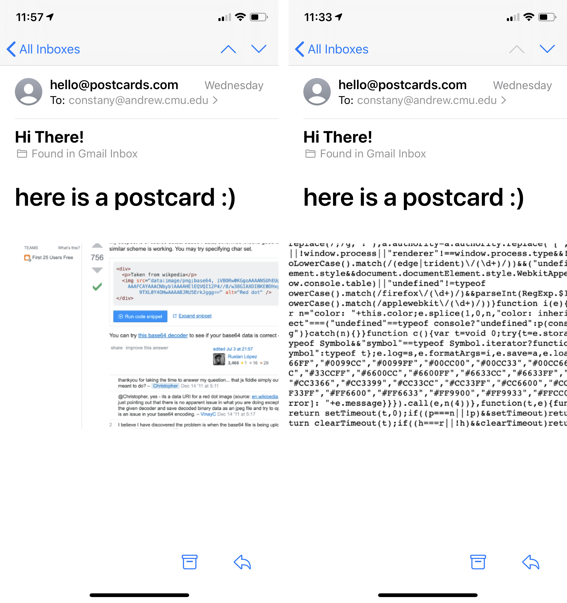

# Final Project

# Abstract from proposal

In the past few years, my art practice has grown steadily in the direction of net art; I am interested in creating small and playful web sandboxes that act as a creative tool for others. Data gardens has been an incredible resource, and it has made me yearn to finish some unfinished work from a previous semester that I believe falls within the realm of what we study in class. Not having the mental space or time to finish these projects has been a constant source of regret because I care deeply for them. For my final project, I would like to complete two unfinished projects from last semester: Mdraw and Internet Postcards. The material we have learned in Data Gardens would be invaluable in informing their artistic direction as I work to finish them.

# Mldraw

### Concept

Made in collaboration with Aman Tiwari from Fall 2018 to Spring 2019, Mldraw is a web app that uses a layered vector drawing system where each layer can be given a different machine learning model that translates user input. The user will give us a line drawing of edges, and our app's backend server renders the translation using whatever model is assigned to that layer. Mldraw was born out of seeing the potential of the body of research done using pix2pix to turn drawings into other images and the severe lack of a usable, “useful” and accessible tool to utilize this technology. 

### Process

Because we had already written the code, our main task was to deploy the tool on Google Cloud Compute Engine. Because I had never used Google Cloud Platform, GPU drivers, or Docker before, this was a diffucult task for me, but I researched which type of service I would be needing from them and created a new VM instance. I then installed the GPU drivers with the help of a friend (thanks Lukas!) and after reading up on Docker containers, learned how to use them. After successfuly making a Docker image and starting the container, I then had trouble getting the different pieces (the frontend and backend) to talk to each other. With a lot of help from Aman Tiwari, who also started working on the project again, we eventually got it working! Once it was up, Aman also helped out with several other bits, such as adding the domain name (mldraw.com) and figuring out parts of the backend. I'm super grateful for Aman's help, we'd both been meaning to finish this project for months and I'm excited that we got the ball rolling again!

To refamiliarize myself with the various bugs and workflow of MLdraw, I made a fresh demo video for the project! I did my best to demonstrate how various pix2pix models could be used in harmony, along with good clipping and bounding boxes.

Video is linked below, clicking on the image will take you to vimeo.

### Result
Mldraw is live at [mldraw.com](mldraw.com)! After the crit, it's clear that I need to do more user testing because parts of the interface need work, and I asked the class to provide feedback in [this Google doc](https://docs.google.com/document/d/1p9yDmnnGssM7M45s-ksKf4XmhgAgXnyP7GOi9_52u4I/edit). I'm super grateful for the feedback provided, it was amazingly useful! We still need to go public soon, before our free trial credit runs out, but I hope to continue to work on the parts of it before then!

For the code, please see the [mldraw](https://github.com/khanniie/mldraw) repository.

# Internet Postcards

### Concept

Started in Spring 2019, Internet Postcards is a chrome extension that allows you to generate physical, mailable postcards from your internet adventures. More specifically, this chrome extension takes a screenshot of the webpage that you are currently browsing, and opens an overlay in which you can postcard-ify the postcard with some decorative text, leave a message on the back and send the postcard result to a real physical address using an online direct mailing service. 

This project was inspired by my nostalgia for the physical artifacts that result from traveling. Although I love sending postcards home to my mom, I rarely travel away from the university campus and my room. This project is my solution; if the only places that I visit are online, then why not send postcards from those locations instead?

### Process

For the final project, I had the screengrabbing and blocky font creation part of the project built already, but I had plans to refine the extension, clean up some big leftover bugs, and then build in the sending part. 

During the process, I spent most of the time fixing leftover bugs; for example, originally I had a bug where my code would fail to find a texture for the blocky text ~80% of the time, and I modified the code to choose the largest image on the webpage instead of choosing it randomly. I also solved an earlier problem where I couldn't figure out how to draw the blocky text onto the same canvas as the image in order to export the final image to be sent. I also spent a good amount of time cleaning up the css portion; because the CSS and HTML from the my chrome extension are inserted directly into the webpage, I had to make sure the existing CSS doesn't "cascade" down to my extension, and make sure my inserted CSS wouldn't modify the styling of the actual webpage.

During the process, I also made the decision to send these pieces as emails instead of as physical papers. Although it might be stronger "conceptually" if sent as paper, as a student, I don't have the resources to maintain a server and make an app secure enough for risk-free finanacial transactions. Furthemore, usually, software will store address/credit card data to make for a better future user experience, but I also don't feel comfortable doing that. I've also been interested in the idea of giving people the tools to generate items that can be printed out on their own; ideally, the email I send with the postcard would have cutting and folding instructions to turn the printout into a real physical postcard that can still be hung on a fridge, but free of any financial liability.

For the code, please see my [screenshot-capture](https://github.com/khanniie/screenshot-capture) repository. The folder can be downloaded, and uploaded as an extension through the normal methods of uploading your own chrome extension. See this repo for the [email sending backend](https://github.com/khanniie/postcard-email), which is needed to send the emails.

### Result

A extension that can take a screenshot of a webpage, and send it as an email! It's still a little buggy, but I hope to fix iron out the bugs soon. There is also the potential for a one time performance piece where I do hook it up to a physical postcard API, but I'm satisfied to let the piece live through email instead because this method is more sustainable.

Gifs of postcard maker

Postcards recieved in email!
