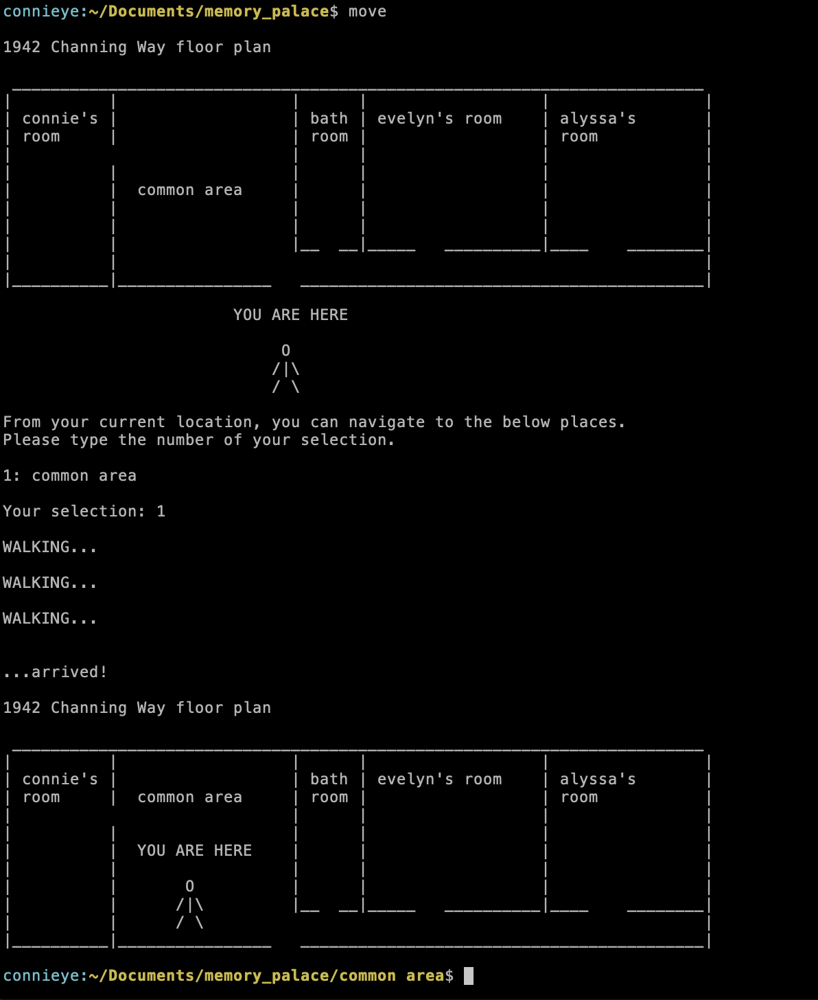
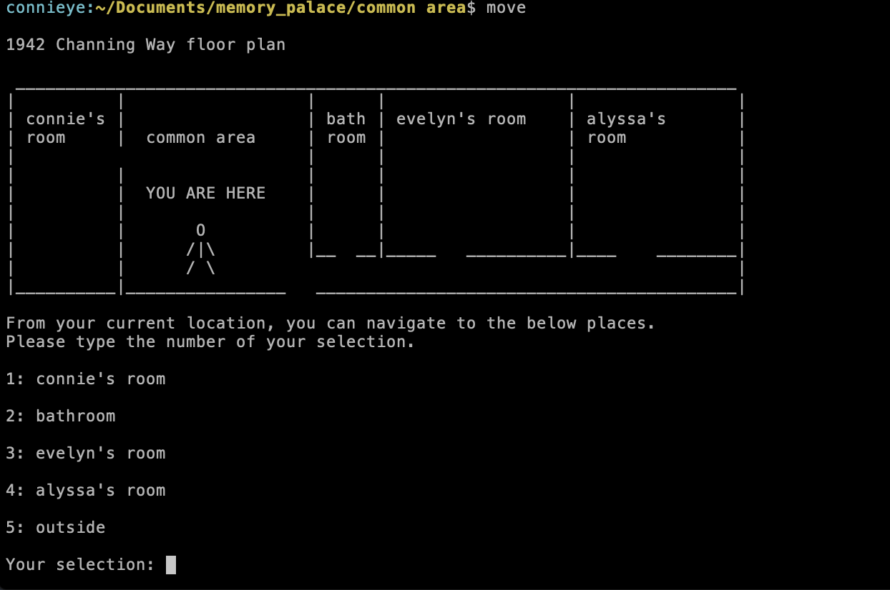
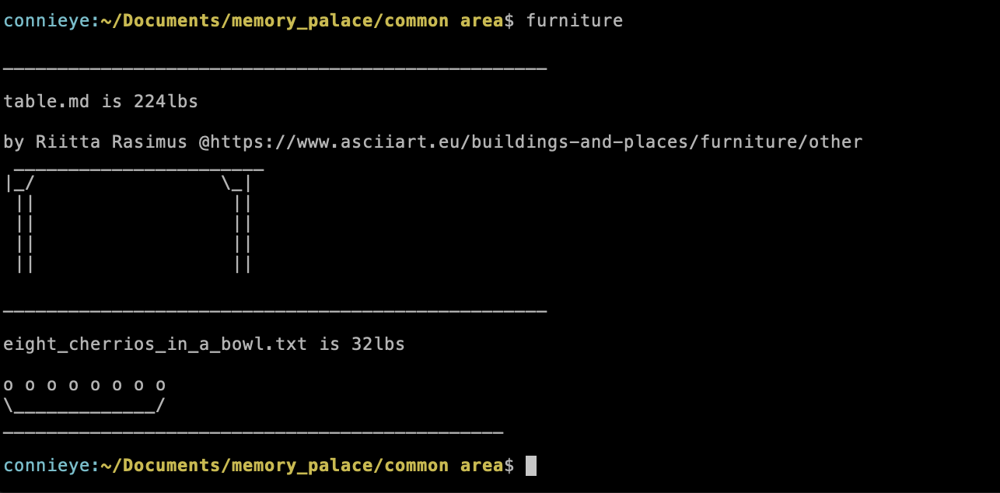
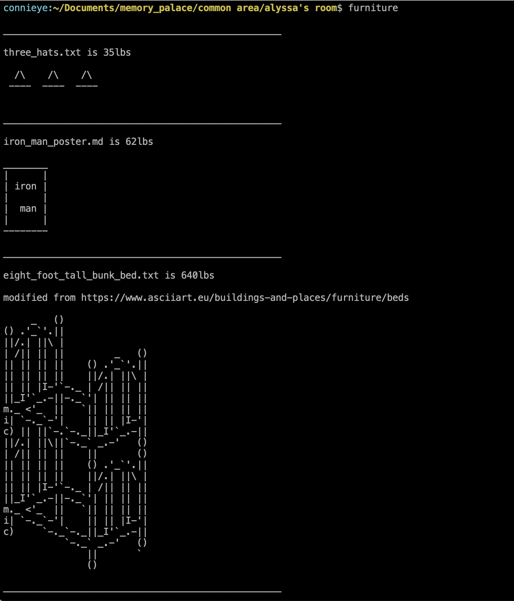

# Memory Palace Assignment

## about
This is the memory palace of Connie, used to memorize her mom's phone number. After installing with the instructions below, the memory palace can be explored with the bash commands `move` and `furniture`, along with numerical input like 1, 2, 3, etc.

`move` will show you where you are "physically" within the memory palace, and provide you with options for where you can go.




`furniture` will print out the contents of the files within this directory, along with their file sizes.




The path through this site is:
1. Common Room
2. Connie's Room
3. Bathroom
4. Alyssa's Room

## install

For the commands used during the presentation to work, we need to set aliases in our .bashrc file.

First, move the files in the scripts_used folder to a folder in the root directory called `scripts`.

Then, in the file at path `~/.bashrc` add these lines:
```
export PS1='\[\033[36m\]\u:\[\033[33;1m\]\w\[\033[m\]$ '

alias furniture='python ~/scripts/furniture.py'
alias move='python ~/scripts/navigate.py'
```

The first line is optional - it is merely used to configure the information displayed in the shell so that it's consistent when the script navigate.py launches a new shell after changing directories (this is the only way I found to change directories permanenty using a Python script).