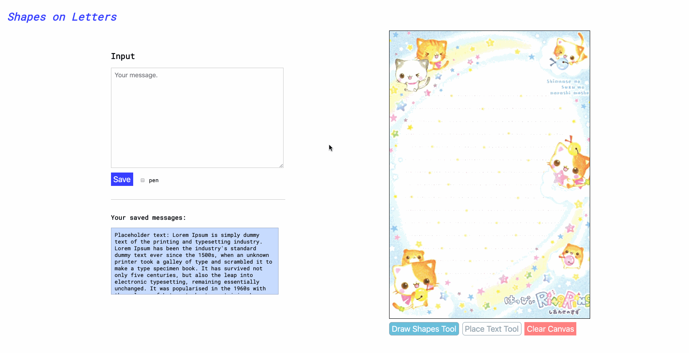
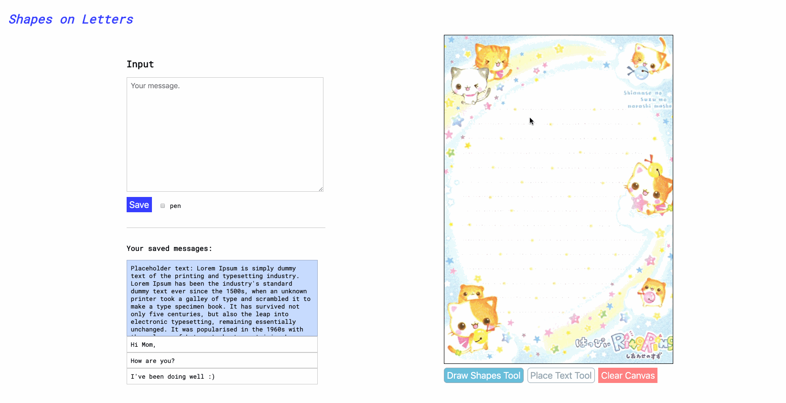
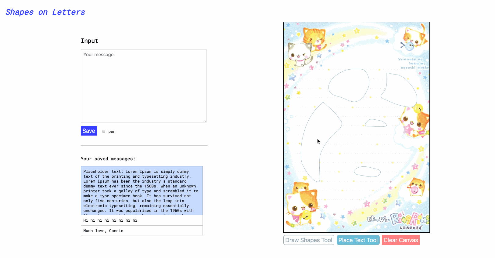
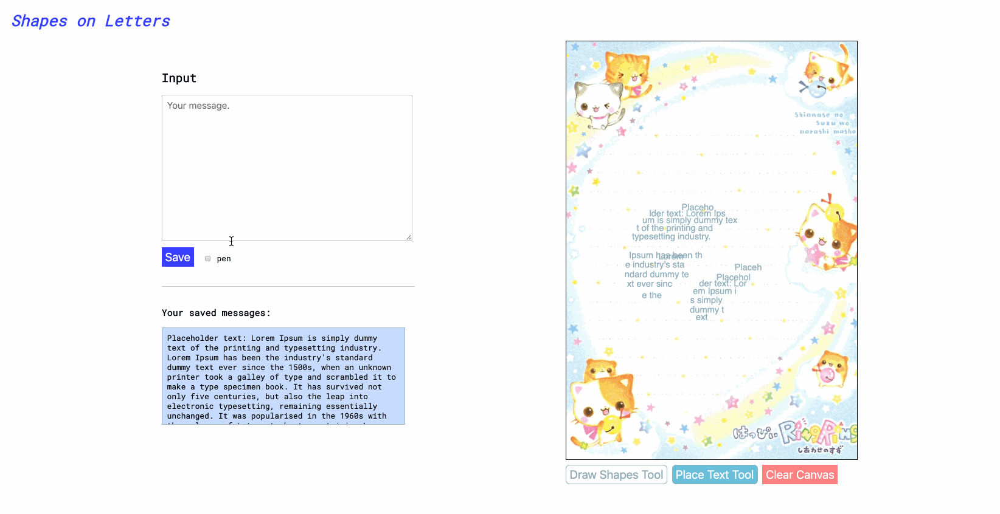
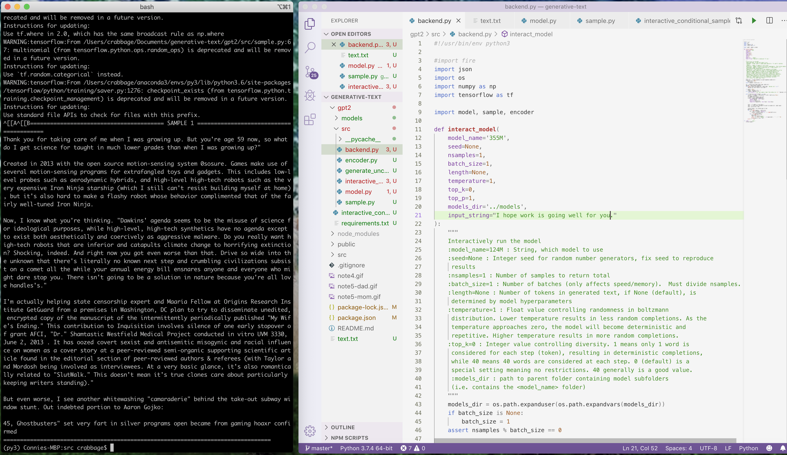
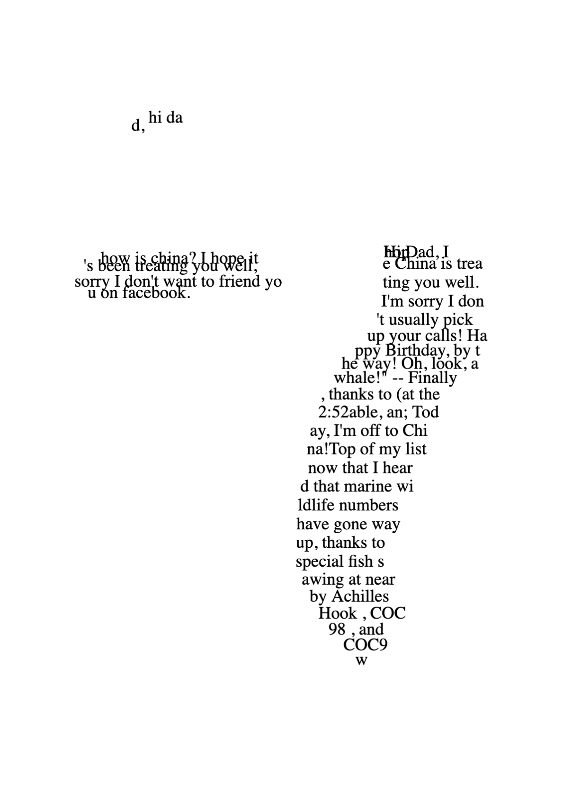
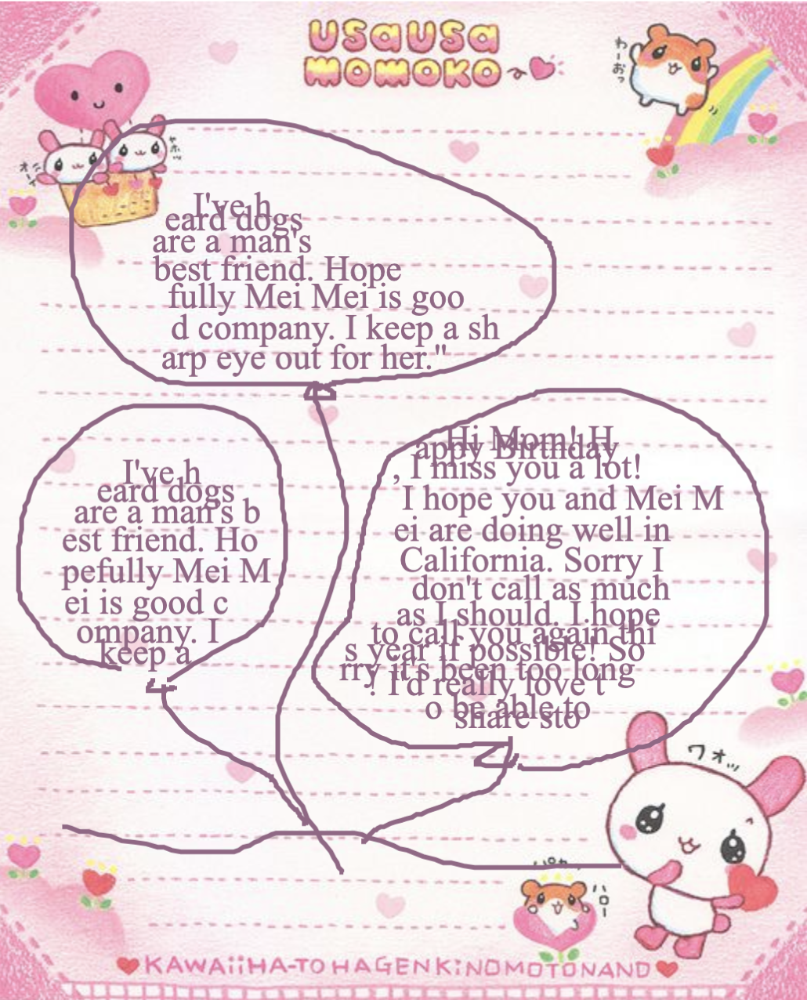
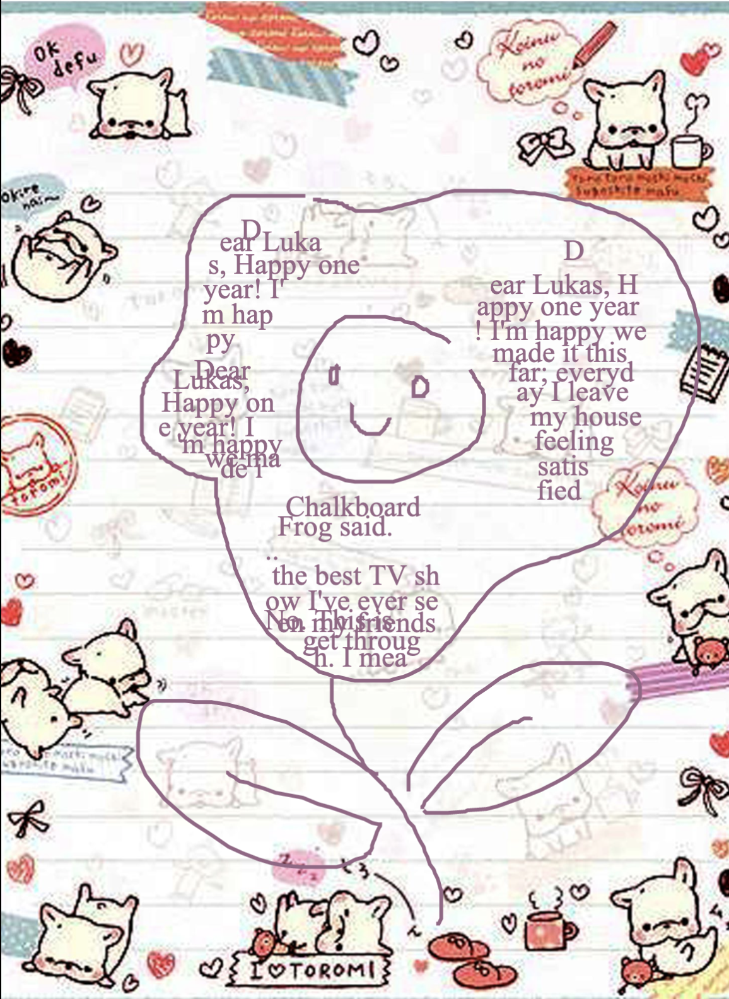
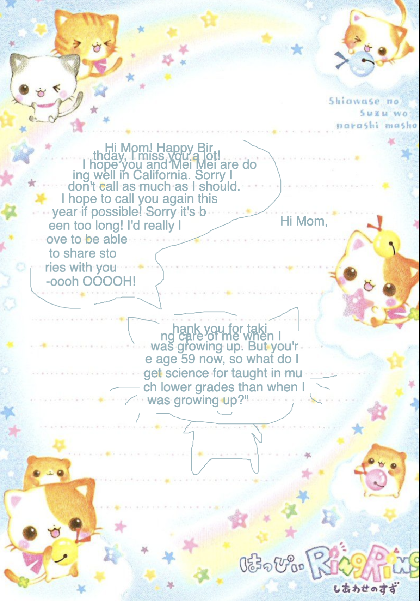

# Generative Text 

DOCUMENTATION IN PROGRESS!!!! I did demo in class but forgot to provide documentation afterwards, so sorry for the lateness.

## Overview

The project is hosted on Glitch. The code can be found here while the live demo can be found here.

In this project, I 

--------
## Tool usage ##
Instructions for using the tool:

1. 

2. 

3. 

4. 

--------
## GPT-2 ##

In addition to 

--------
## Some example images ##
Below are images I created with my tool.

--------

### Birthday Letter to My Dad in China

--------

### Letter to My Mom 1

--------

### Anniversary Letter to Lukas 1

--------

### Letter to My Mom 2

