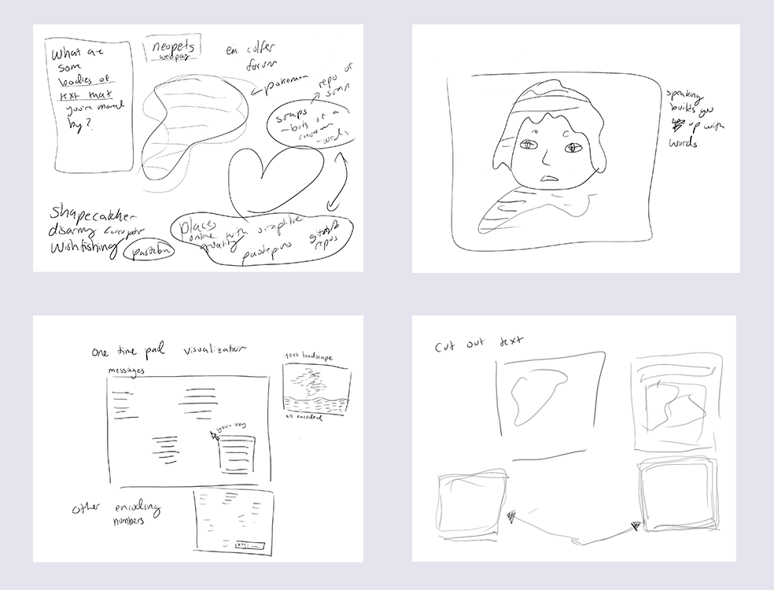

# Generative Text 

Note: I did demo in class but forgot to provide documentation afterwards, so sorry for the lateness!

## Overview

The project is hosted on Glitch. The code can be found [here](https://glitch.com/edit/#!/shapes-on-letters) while the live demo can be found [here](https://shapes-on-letters.glitch.me).

Shapes on Letters is a online tool that allows the visitor to draw shapes upon a letter and fit their message into that shape. It is alternative letter-writing method. 

More information about usage, concept, and more is below.

--------
## Concept & Process ##

For this project, I considered many different ideas, including a ascii webcam piece, a extension to cut out poetic chunks from webpages, a landscape made of encoded messages encoded using one time pad, etc.

I was inspired by our in-class lecture on Emily Dickinson's practice of making poetry that was built for the scraps of paper that she collected deliberately. Based on that, I wanted to make a web experience about drawing shapes and filling those shapes with text. The part I strugged with was figuring out what the text that filled the shape should be. 

Everest had a really great idea that the shape could influence the text within. I landed upon the idea of making a tool for generative booklets. Someone would draw a shape, and I would use a [quickdraw classifier](https://github.com/clfkenny/quickdraw-sketch-classifier) to generate a noun to be fed into GPT-2, which would then generate the text. However, I talked to someone (Golan) who asked me why I was making them; what's the benefit for the person using the tool? How is it personal? Is it a gift? This was a really excellent point, and I ended up pivoting the project to be more personal for me. 

Since I had a lot of anniverseries and birthdays coming up that I needed to make letters/cards for, I wanted to try making this tool suitable for that purpose while retaining the original inspiration of Emily Dickinson's scrappy poetry. I was reminded of my habit of doodling within my letters to others to make up for my inability to come up with actual words for the letter. I've always felt slightly embarrased when my friends are able to write essays in their cards and I can barely come up with three sentences; it's not that I don't care, I just struggle to express myself with words. 

Thus, I wanted to create a letter-writing tool for myself specifically, where I could harmoniously merge my doodling habits with my sparse writing habits.

After creating the tool, I realized that I still needed more text than I had the emotional energy to generate; so I wanted to see if GPT-2, which I had considered using for a different purpose before, could complete me. I provided it with a few sentences of my writing, let it complete it, kept it if I liked the result, and added a bit more from me.

I then used this text that I generated as an input for my letter; the output was basically always never satisfactory, but every once in a while it was suprisingly accurate. To respect the spirit of letter-writing in collaboration with a machine, I kept a mixture of the good output and the unexpected output in the letters I wrote. However, this experience with GPT2 showed me how that although the GPT2 output is coherent and context-related, it is emotionally blind.

Ultimately, for me, I think this project ended up being an exercise in how machines could help me write and curate personal artifacts for those I care about.

--------
## Usage ##
Instructions for using the tool:

1. Input some text for your letter and save when done. The result will be put into the saved messages bank below to be used later.

2. Draw shapes on the letter to the right. Note that the paths autoclose. 

3. Fill your shapes with the messages you saved earlier by selecting the "Place Text Tool," clicking on the message you want to fill with, and then clicking on the shape.

4. You can also use the pen tool (right of the save button) to doodle alongside your text.

--------
## GPT-2 ##

As I talked about briefly in the concept section, I added to my own writing with GPT-2. I downloaded the model and sample code from the [OpenAI Github](https://github.com/openai/gpt-2). I then wrote prompts and continuously generated results until I found some that I liked or gave up. 

Some examples of results that were generated:

1. Letter to Mom 1

    a. My input: Hi Mom! Happy Birthday, I miss you a lot! I hope you and Mei Mei are doing well in California. Sorry I don't call as much as I should.

    b. GPT output: Hi Mom! Happy Birthday, I miss you a lot! I hope you and Mei Mei are doing well in California. Sorry I don't call as much as I should. I hope to call you again this year if possible! Sorry it's been too long! I'd really love to be able to share stories with you-oooh OOOOH!

2. Letter to Mom 2

    a. My input: Is California hot at this time of the year?

    b. GPT output: Is California hot at this time of the year? Yes No Unsure Do you have to pay for wi-fi at this place or activity? Yes No Unsure Do veterans receive discounted pricing? Yes No Unsure...

3. Letter to Mom 3

    a. My input: Thank you for taking care of me when I was growing up.

    b. GPT output: Thank you for taking care of me when I was growing up. But you're age 59 now, so what do I get science for taught in much lower grades than when I was growing up?"

4. Letter to Dad

    a. My input: Hi Dad, I hope China is treating you well. I'm sorry I don't usually pick up your calls! Happy Birthday, by the way!

    b. GPT output: Hi Dad, I hope China is treating you well. I'm sorry I don't usually pick up your calls! Happy Birthday, by the way! Oh, look, a whale!" -- Finally, thanks to (at the 2:52able, an; Today, I'm off to China!Top of my list now that I heard that marine wildlife numbers have gone way up, thanks to special fish sawing at nearby Achilles Hook , COC98 , and COC9 which are catching whales they then hone and whittle if it would be of interest to anyone interested in the World Wide Web across China.)My biggest fears might just be that I've led you into a question to which we must hide or find solutions if only we can pay up...

--------
## Some example images ##
Below are images I created with my tool.

--------

### Birthday Letter to My Dad in China

--------

### Letter to My Mom 1

--------

### Anniversary Letter to Lukas 1

--------

### Letter to My Mom 2

--------
## Credits ##

My app uses [paper.js](http://paperjs.org). Thank you to Everest and Golan for talking with me about the concept! Thank you also to those who created GPT2 and the internet who contributed to the creation of it.

I got my stationary images from these links. 
1. [cute cat stationary](https://www.pinterest.com/pin/382454193347624347/?lp=true)
2. [heart stationary](http://kinocop.co/cute-stationery-paper/)
3. [dog? stationary](https://www.pinterest.com/pin/431430839285405215/?lp=true)