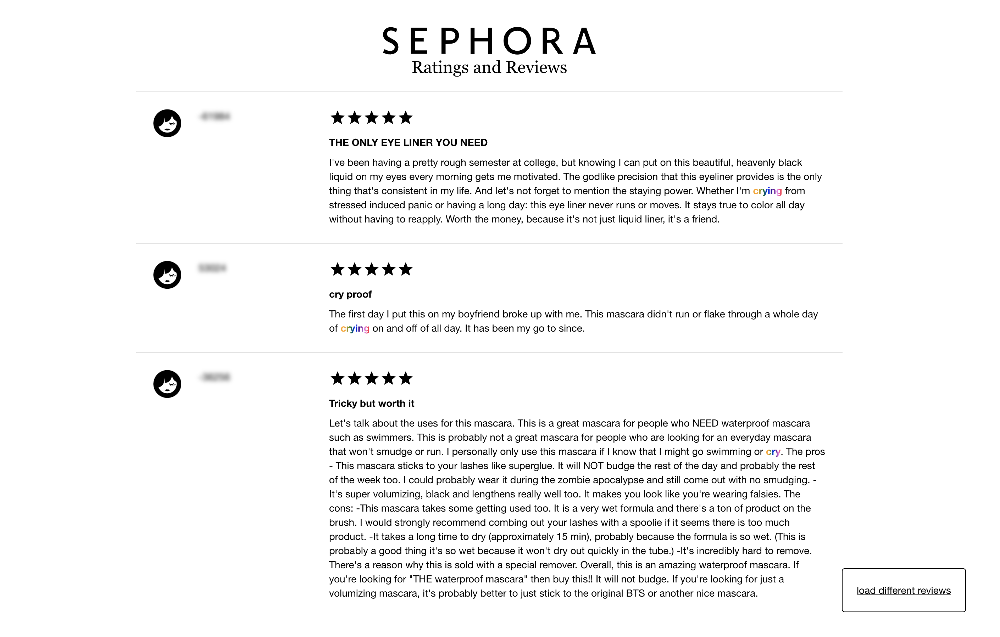
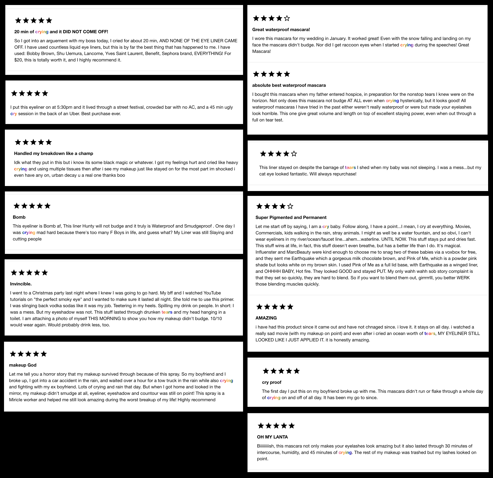

# Sephora Reviews that Mention Crying, Sobbing or Tears
## Concept
In high school, I spent a lot of time reading Sephora reviews in pursuit of the perfect object because I was afraid of wasting my money. When I read the prompt for this dataset, I remembered how extensive the data on Sephora's webiste had been.

A popular metric for a successful waterproof product is whether or not it can withstand tears and emotional turmoil. I remembered seeing a review giving an eyeliner 5 stars for surviving through a teary breakup, and I wanted to see if there would be more. Thus, for this project, I scraped Sephora's website for reviews, and filtered through them for reviews mentioning crying.

I ended up scraping about ~5k reviews, and 105 of them mentioned crying, sobbing or tears, giving a ratio of about 1/50. This is of course a biased number because the products the reviews are for are meant to withstand water, but I was still surprised to find so many. I was also surprised by how confessional and emotional people were willing to be in their reviews; I saw stories about breakups, death of loved ones, weddings, fights and more. However, despite the tragedy underlying many of the stories, the tone was often strangely positive, providing exuberant praise for the product that allowed them to maintain their makeup throughout the tragedy. 

## Online Viewer
I made a site to view these reviews through! Visit [this online viewer](https://connie.dog/sephora/).

Here are some of the reviews that I found.

## Files
1. [crying_dataset.json](crying_dataset.json): Contains 105 makeup reviews from Sephora that mention crying, tears or sobbing. Usernames have been changed to less revealing "user ids" with a hash function.
2. all_json folder: Contains json files with the raw review data (not just tears) for the 13 products I scraped the reviews from.
3. [username_credit.txt](helpers/parse_data.py): Thank you to the Sephora users who are a part of my dataset.
4. [helpers/parse_data.py](helpers/parse_data.py): The file I used to process the data and filter the raw json data to make the final "crying reviews" dataset.
5. [helpers/sephora.js](helpers/sephora.js): This file contains snippets of code I would run in the browser console in order to scrape the review data. I couldn't use beautiful soup because Sephora hides the reviews until you click the "Load 6 more" button. So I had to write a script that would continuously click the button. I think Sephora's server clamps the number of responses it sends back to an address for some time frame, because I noticed that I could only get 30 reviews at a time no matter how many times my script "clicked." So I had to manually visit a page, give the button to click an id (there's no id because Sephora uses React to build their site), and then run my script to click over and over until I had loaded 400 - 700 reviews. I couldn't just save the page source, since the page source shows the source code and not the dynamically rendered content. Sadly, I also couldn't just save the rendered HTML from the developer tools to parse at that point because whenever I would do that, it would be missing significant chunks of information (page size too large with those hundreds of reviews perhaps?). So, I then ran the bottom half of the snippet to convert the parts that I wanted into json data, which I then downloaded.

## Stats:
    1. 5018 total reviews
    2. 13 different products
        a. 5 mascara
        b. 5 eyeliners
        c. 1 face primer
        d. 1 eye primer
        e. 1 setting spray
    3. 105 total crying reviews found
