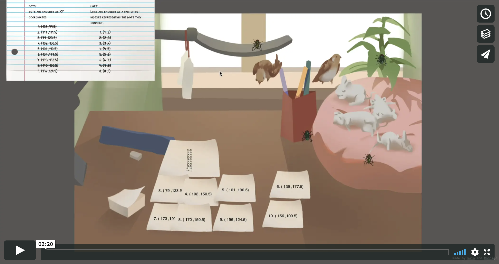

# Muscle Messenger

A (hypothetical) message sending tool that is made possible by the help of small animals.

Created by [Connie Ye](https://connieye.com/) and [Rain Du](https://miyehn.me)

*All of the lovely art is by Rain.*

## How it works

To send a message (an image) with **Muscle Messenger**, the sender encodes an image with dots and line segments connecting them, and then lets many small animals physically send the encoded image, each carrying only a small piece of the entire message. 

This is an effort to secure private communication during the time of quantum computing, when all modern digital encryptions lose effect because they can be quickly hacked by quantum computers. In the age of quantum computing, digital communication will no longer be private unless we change our encoding methods.

With **Muscle Messenger**, it's hard for anyone other than the receiver to recover the original message, as they don't know which animals are carrying pieces of the message, and even if they did, they would have to catch them all! In other words, the solution to digital failure is paper and real muscle.

## Presentation Slides

A more thorough explanation of our concept can be seen in our presenation slides: 

## Video Walkthrough

The video linked below shows how our interactive message-sending game functions. (clicking on this image directs you to [Vimeo](https://vimeo.com/374707461))

## Screenshots of the sending/recieving functions

Above is an example of the sender encoding an image.

Above shows how the receiver recovers the original message.

## Inspirations

For this project, we were inspired by cryptography, pideon carriers, networking methods such as packets, and more. Cryptography is a wonderfully rich field, and a fascinating part is that many modes of encryption rely upon the idea that some problems (factoring a large product of prime numbers) are just too computationally heavy to solve. For this project, we were inspired by the tension between the rapid improvement of computing power and our reliance upon computational limits.

## Usage

### Sending messages

1. Go to [the sending side](https://send-message.glitch.me/) (built by Connie).
2. Click on the paper on the desk, choose an image file to encode, and encode it as directed by the interface.
3. Click on the pile of stickers on the left to prepare for sending messages. Then click on the stickers laid out on the desk to write pieces of the message down. 
4. Finally, drag the stickers onto any of the animals (flies, rats and birds) to send the message!

### Receiving messages

1. Go to [the receiving side](https://receive-message.glitch.me/) (built by Rain).
2. You may see the animals coming in over time. This means you have a message to receive. You can hover over each individual animal to see what piece of information it carries, but it's often not helpful for figuring out the entire message.
3. You have to wait until the special piece of information arrives- the one that tells you how to connect the dots, before you can click on the paper on the desk, and click on the animals to plot down the information each of them carry.
4. Then you can finally piece together pieces of information by drawing to connecting the dots as directed.
